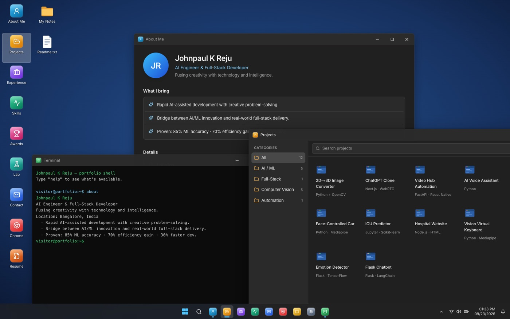
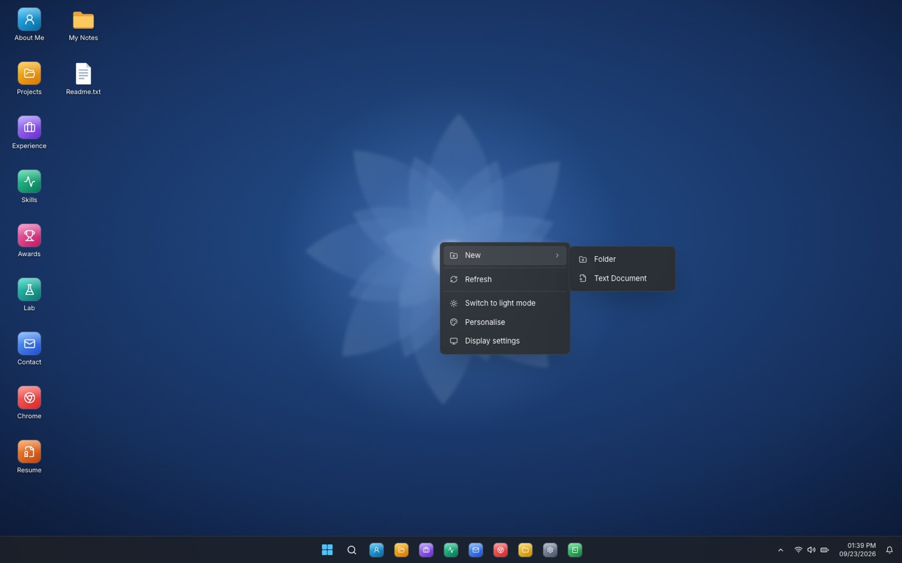
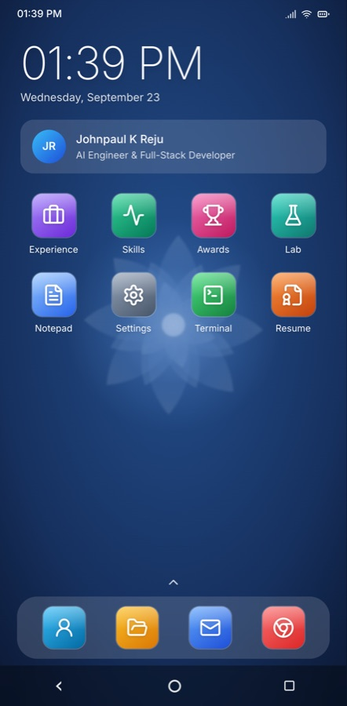
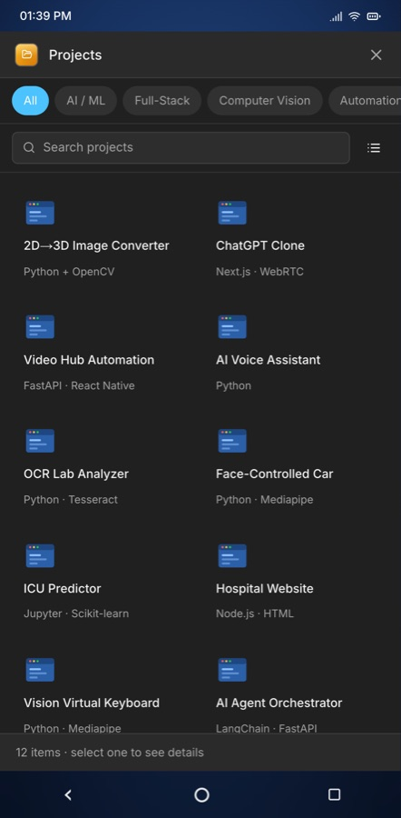
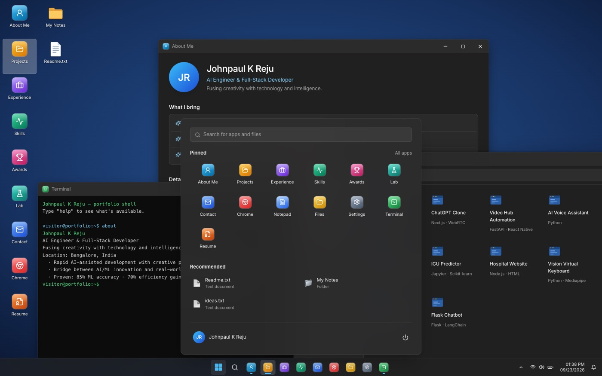

# Portfolio OS

A portfolio that boots.

Instead of a page you scroll, this is a desktop operating system you use. It starts
with a boot screen, lands on a Windows 11–style desktop, and every section of the
portfolio — About, Projects, Experience, Skills — is an app you open in a real,
draggable window. On a phone it becomes an Android home screen instead.

**[Johnpaul K Reju](mailto:johnpaulreju2k@gmail.com)** · AI Engineer & Full-Stack Developer · Bangalore, India



---

## The concept

Most developer portfolios are a scrolling page with sections. They all read the same,
and none of them actually *show* you anything — they tell you the person can build
software, then ask you to take it on faith.

So this one is the proof rather than the claim. A desktop environment is a genuinely
hard UI problem: overlapping windows, z-order, drag and resize, focus, a filesystem,
context menus, two completely different input models. Building one that feels right
*is* the portfolio. The content lives inside it as apps, so reading about the work and
experiencing the work are the same act.

Two rules kept it honest:

1. **Nothing is a picture of itself.** The windows really drag and resize. The
   filesystem really stores files, and they survive a reload. Notepad really saves.
   If something looks interactive, it is.
2. **Nothing is borrowed.** No Microsoft wallpapers, logos, or icon assets — every
   piece of artwork here is original CSS and SVG written for this project.

---

## What's in it

### Desktop — Windows 11 (≥ 768px)

| | |
|---|---|
| **Boot** | Staged boot sequence with an orbiting-dot spinner; skipped entirely for `prefers-reduced-motion` |
| **Windows** | Drag by title bar · resize from all 8 edges · minimize / maximize / restore / close · click-to-raise z-order · double-click title to maximize |
| **Snap** | Drag to the top to maximize, to either side to fill half — with a live translucent preview before you drop |
| **Taskbar** | Centered, acrylic, live clock and date, system tray, per-app running indicators (the focused app gets a wider pill) |
| **Start menu** | Searches apps *and* your files, pinned grid, Recommended, power button that reboots the whole thing |
| **Right-click** | Desktop (New ▸ Folder / Text Document, Refresh, theme, Personalise), files (Open / Rename / Delete), taskbar, and app icons |
| **Files** | Create, rename inline (`F2`), delete (`Del`), nest folders — persisted to `localStorage`, so what you make is still there next visit |
| **Theme** | Real light/dark switch — wallpaper, chrome, taskbar and every app follow it |



### Mobile — Android (< 768px)

A desktop metaphor is miserable on a phone, so below 768px the whole shell is
replaced rather than squeezed: status bar, clock widget, app grid, dock, swipe-up
app drawer with search, recents, and a back / home / recents nav bar. Apps open
fullscreen and reflow — the Projects explorer drops its sidebar for filter chips.

<p align="center">
  
  &nbsp;&nbsp;
  
</p>

### The 13 apps

| App | What it is |
|---|---|
| **About Me** | Profile, what I bring, contact details |
| **Projects** | File-Explorer-style browser — categories, search, grid/list views, details pane |
| **Experience** | Work and education timeline |
| **Skills** | Task-Manager-style meters that animate on open |
| **Awards** · **Lab** | Certifications and wins · experiments in progress |
| **Contact** | A Mail client; composing hands off to your own mail app |
| **Chrome** | Tab strip, omnibox, and in-app GitHub / LinkedIn / portfolio pages |
| **Notepad** | Opens and saves real files · `Ctrl+S` · word wrap · Ln/Col/word/char status bar |
| **Files** | Explorer over the same filesystem — breadcrumbs, New, rename, delete |
| **Settings** | Theme picker with live previews, storage reset |
| **Terminal** | `help` lists 12 commands — `projects`, `skills`, `ls`, `cat`, `open` and more — with arrow-key history |
| **Resume** | A document in a PDF-viewer chrome; prints to real PDF |



---

## How it was made

### Stack

Deliberately small. Five runtime dependencies, no UI kit, no animation library.

```
Next.js 14 (App Router)  ·  React 18  ·  TypeScript  ·  Tailwind CSS 3
zustand    — window + filesystem state
lucide-react — icons
```

Everything else — window chrome, context menus, the scheduler, the wallpaper — is
written from scratch. There is no `three`, no `framer-motion`, no Radix.

### Architecture

The whole thing is one route. Two shells render from one set of apps:

```
app/page.tsx                   picks a shell from a media query, after boot
│
├── components/os/desktop/     Windows 11 shell
│     desktop-shell            wallpaper + icons + windows + taskbar
│     window-frame             drag, 8-way resize, snap, title bar
│     taskbar · start-menu · desktop-icons · context-menu
│
├── components/os/mobile/      Android shell
│     phone-shell              status bar, home, drawer, recents, nav bar
│
├── components/os/app-host     maps an AppId to its component
├── components/os/apps/        the 13 apps — shared by BOTH shells
│
└── lib/os/
      content.ts               all portfolio data, single source of truth
      wm-store.ts              window manager (zustand)
      fs-store.ts              virtual filesystem (zustand + localStorage)
      app-meta.ts              app registry: title, icon, size, pinned
```

Three decisions did most of the work:

**Content is data, not markup.** Every project, skill and timeline entry lives in
`lib/os/content.ts`. The apps, the Terminal, the Resume and the in-app GitHub page
all render from it, so a fact is written once and can never drift between views.

**Apps don't know which shell they're in.** An app is just a component. The desktop
wraps it in a `WindowFrame`; the phone wraps it in a fullscreen surface and hands it
a stub window object. Adding an app means one file plus one registry entry, and it
works in both places.

**Gestures stay local until they finish.** Dragging a window updates local component
state and only commits to the store on release. Nothing else re-renders mid-drag,
which is what keeps it smooth with several windows open.

### Theming

One `data-theme` attribute on the root swaps a set of CSS custom properties
(`--os-window`, `--os-chrome`, `--os-accent`, …). Components reference the variables,
never the colours, so light mode was mostly free.

### The wallpaper

Layered translucent SVG ribbons around a soft core, blurred with `feGaussianBlur`.
It took three passes — the first read as a giant daisy, the second as a starburst —
before it settled into something abstract enough to sit behind icons. No image file,
so it costs nothing to load and scales to any viewport.

---

## Running it

```bash
pnpm install
pnpm dev        # http://localhost:3000
```

```bash
pnpm build      # production build (type errors and lint failures fail the build)
pnpm typecheck  # tsc --noEmit
pnpm lint
```

> Resize the browser below 768px to switch between the two shells.

---

## Try these

The fastest way to see it's real:

- **Right-click the wallpaper** → New → Folder. Name it. Reload the page — it's still there.
- **Double-click `Readme.txt`**, type something, hit `Ctrl+S`.
- **Drag a window to the left edge** and watch the snap preview appear before you drop.
- **Open Terminal** and run `help`, then `skills`.
- **Click the tray clock area** (wifi/volume/battery) to flip the whole OS to light mode.
- **Open two windows** and click between them — watch the taskbar indicators change.

---

## Notes

Known gaps, listed honestly: browser back/forward are decorative, recents shows
placeholder thumbnails rather than live previews, desktop icons can't be dragged to
new positions, and mobile has no long-press menu yet.

Built as a portfolio for Johnpaul K Reju.
Microsoft, Windows, Android and Chrome are trademarks of their respective owners;
this project imitates their interfaces from scratch and ships none of their assets.
